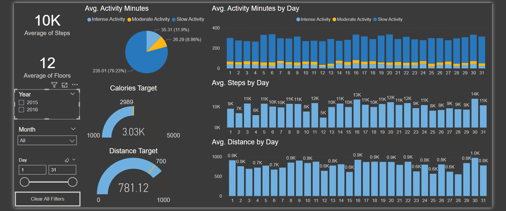

# Overview

A fitness analysis application designed to track, analyze, and optimize your workouts and health metrics, helping you achieve your fitness goals with personalized insights and progress tracking.

  For data source click her: [Fitness Data](Data_Source/Data_Source.rar)

  Short video on LinkedIn: [Video](https://www.linkedin.com/posts/johnrizkalla_dataanalysis-powerbi-fitnessapp-activity-7235714321396183041-yFSD?utm_source=share&utm_medium=member_desktop)

# Tools Used
  * Power BI

# KPIs
* Calories Target
* Distance Target
* Avg. Steps Count
* Avg. Floors Count
  
# The Analysis

  ### 1. Avg. Activity Minutes & Activity type by Day
  ### 2. Activity type percentage from total types
  ### 3. Avg. Steps by Day
  ### 4. Avg. Distance by Day
  
  
  
  # Insights

  #### 1. Real-time Progress Tracking: Monitor your progress with detailed analytics on your performance, keeping you motivated and informed.

  #### 2. Goal Setting & Achievement: Set specific fitness goals, helping you stay on track and celebrate your successes.

  #### 3. Data-Driven Insights: Leverage advanced algorithms to gain insights on your strengths and areas for improvement, allowing you to fine-tune your routine for better results.
